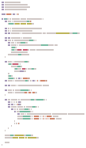

# minimap

`minimap` is a command line program that takes source code file(s) as input and outputs an image containing the minimap(s) of the code.

Soon, it will also be able to take diffs as input, and output an image showing the minimap of each changed file, highlighting the added and removed lines. This may be useful for visualizing git commits or PRs, and for showing an overview of changes to be made in each chapter/section of a project-based tutorial.

## Install

    $ cargo install minimap

## Usage

Currently, `minimap` takes one command line argument: a path to a source code file to generate a minimap for. It always outputs to `minimap.png` for now.

    $ minimap src/main.rs
    Minimap written to minimap.png

## Example

Here is `src/main.rs` from this repo, rendered as a minimap:

